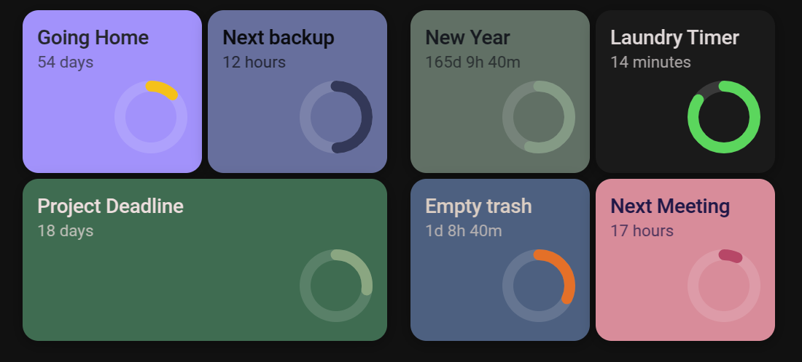

# TimeFlow Card

 

A beautiful countdown timer card for Home Assistant with animated progress circle and intelligent time formatting.



## ✨ Features

- Animated SVG progress circle with dynamic scaling
- Smart time display with natural language formatting
- Customizable colors, sizes, and time units
- Entity support for dynamic countdowns
- Cross-platform date parsing

## 🚀 Installation

### HACS (Recommended)
1. Open HACS → Frontend → "+" button
2. Search for "TimeFlow Card" and install
3. Add to your Lovelace configuration

### Manual
1. Download `timeflow-card.js` from [releases](https://github.com/Rishi8078/TimeFlow-Card/releases)
2. Copy to `config/www/` directory
3. Add to resources:
```yaml
resources:
  - url: /local/timeflow-card.js
    type: module
```

## 📝 Configuration Examples

### Basic Countdown
```yaml
type: custom:timeflow-card
title: "New Year 2026"
target_date: "2026-01-01T00:00:00"
show_days: true
show_hours: true
show_minutes: false
show_seconds: false
```

### Dynamic Entity Timer
```yaml
type: custom:timeflow-card
title: "Washing Machine"
target_date: sensor.washing_machine_end_time
creation_date: input_datetime.wash_start
background_color: "#2196F3"
progress_color: "#4CAF50"
expired_text: "Wash Complete!"
```

### Customized Styling
```yaml
type: custom:timeflow-card
title: "Project Deadline"
target_date: "2025-03-15T17:00:00"
width: "300px"
height: "200px"
styles:
  title:
    - color: "#FF5722"
    - font-size: 1.8rem
  card:
    - border-radius: 15px
```

### Compact Mobile Widget
```yaml
type: custom:timeflow-card
title: "Timer"
target_date: "2025-12-31T23:59:59"
width: "150px"
aspect_ratio: "1/1"
show_days: true
show_hours: false
show_minutes: false
show_seconds: false
```

## ⚙️ Configuration Options

| Option | Type | Default | Description |
|--------|------|---------|-------------|
| `target_date` | string | **Required** | ISO date or entity ID |
| `title` | string | `"Countdown Timer"` | Card title |
| `creation_date` | string | `null` | Start date for progress |
| `expired_text` | string | `"Completed! 🎉"` | Text when expired |
| `show_*` | boolean | `true` | Show time units (months/days/hours/minutes/seconds) |
| `width/height` | string | `null` | Card dimensions |
| `aspect_ratio` | string | `"2/1"` | Card proportions |
| `color` | string | `"#ffffff"` | Text color |
| `background_color` | string | `"#1976d2"` | Card background |
| `progress_color` | string | `"#4CAF50"` | Progress circle color |

## 🐛 Troubleshooting

**Card not showing?**
- Check Lovelace resources are added correctly
- Verify `target_date` format: `"YYYY-MM-DDTHH:mm:ss"`
- Clear browser cache

**Entity issues?**
- Ensure entity exists and has valid datetime state
- Use ISO format in entity states
- Check entity availability in Developer Tools

**Mobile problems?**
- Use ISO 8601 format for cross-platform compatibility
- Avoid spaces in date strings

## 📄 License

MIT License - see [LICENSE](LICENSE) file for details.

---

**Made with ❤️ for the Home Assistant community**
